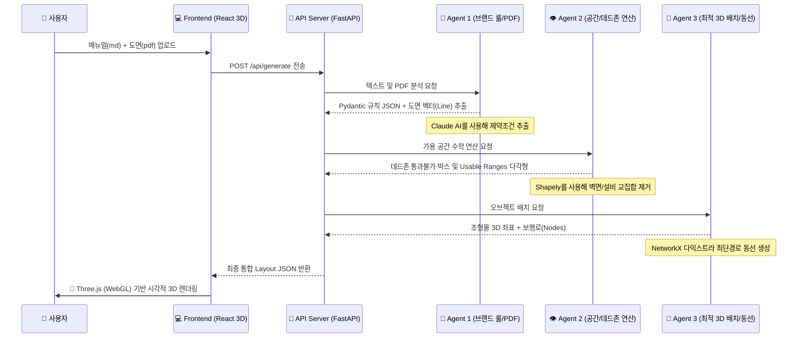

# 🏗️ LandingUp AI 프로젝트 중간 점검 및 아키텍처 오버뷰

현재까지 생성된 수많은 파일들과 AI 파이프라인의 복잡한 흐름을 한눈에 이해하고, 앞으로 나아가야 할 방향을 정리한 총괄 문서입니다.

---

## 1. 프로젝트 아키텍처 및 처리 흐름도

시스템은 크게 **React 화면(Frontend)**, **FastAPI 중계기(Backend)**, 그리고 **3명의 AI/수학 연산 요원(Agent)**으로 구성되어 있습니다.



### 흐름 부연 설명
1. 사용자가 브라우저에서 버튼을 누르면, 백엔드 서버가 두 파일을 넘겨받아 파이프라인 체인을 가동시킵니다.
2. **Agent 1**은 `Anthropic API`를 호출해 메뉴얼 문자열에서 정확한 이격 거리, 방향 규칙 등을 JSON으로 뽑아냅니다.
3. **Agent 2**는 이미지나 도면에서 소화전/출입구를 파악(현 임시 강제값 부여)하고, 로봇이 들어갈 수 있는 파란색 '가용 영역'을 그립니다.
4. **Agent 3**는 그 확보된 가용 영역 안에서 50cm 간격으로 빈자리를 찾아 조형물 테트리스(배치)를 하고, 장애물들을 피해 사람들이 걸어 다니는 길(동선)을 찾습니다.
5. 완성된 좌표들을 프론트엔드가 받아 가상 세계 카메라(Three.js) 위에 그려냅니다.

---

## 2. 사용된 기술 스택과 선정 이유 (+ 대체 모델)

| 구분 | 현재 사용 스택 | 선정 이유 (Why?) | 추천 대체 스택 (Alternatives) |
| :-- | :--- | :--- | :--- |
| **프론트엔드** | React, Vite, `TailwindCSS` | 강력한 생태계와 빠른 UI 렌더링. 컴포넌트 관리가 편함. | Vue 3 (더 가벼운 진입장벽) |
| **3D 렌더링** | `Three.js` + `@react-three/fiber` | 웹 브라우저에서 플러그인 없이 무설치로 3D 도면을 가볍게 렌더링할 수 있는 최고의 조합 | `Babylon.js` (성능 우선 웹-게임 엔진 느낌, 단 React 연동은 피버보다 무거움) |
| **백엔드 (API)** | `FastAPI` (Python) | 파이썬의 AI 모듈들을 즉시 쓸 수 있고, 비동기(ASync) 처리가 타 프레임워크보다 압도적으로 빠름 | `Flask` (더 단순하지만 느림), `Express.js` (Python 모듈 사용이 불가해 AI 연동에 치명적) |
| **AI LLM 연동** | `Anthropic SDK (Claude 3.5)` | 텍스트 지시(JSON 포맷 강제)를 GPT보다 정확하게 말을 잘 듣고, 환각이 적음 | `OpenAI (GPT-4o)` (비전/이미지 인식에서 약간 더 우수) |
| **데이터 검증** | `Pydantic` | AI가 임의로 만든 응답이 무조건 "숫자(mm)"인지 "문자열"인지 방어하기 위해 필수 | `Zod` (TS/JS 전용, 파이썬에선 Pydantic이 원탑) |
| **수학/기하학** | `Shapely`, `NetworkX` | AI에 의존하지 않고 100% 확률의 물리 엔진(교집합, 충돌, 다익스트라 최단 거리 계산)을 보장 | `OpenCV` (픽셀 단위 계산이라 무겁지만 형태 인식에 좋음) |
| **PDF 벡터 추출**| `PyMuPDF (fitz)` | PDF의 압축된 CAD 선들을 좌표로 분해하는 파이썬 라이브러리 | `pdfplumber` (표/텍스트 위주에 유용, 라인 추출은 fitz가 우세) |

---

## 3. 코드 실행 순서 및 환경 설정

**① 파이썬 (백엔드) 라이브러리 설치 목록**
```bash
pip install fastapi uvicorn python-multipart pymupdf shapely networkx python-dotenv anthropic pydantic
```
**② 노드 (프론트엔드) 패키지 설치 목록** (이미 `node_modules`에 설치됨)
```bash
npm install
# 주요 내역: react, three, @react-three/fiber, @react-three/drei, axios 등
```

**✅ 시스템 정상 구동 순서**
1. **[터미널 1]** `npm run dev` (프론트엔드 5173 켜기)
2. **[터미널 2]** `.venv\Scripts\activate` (파이썬 독립 공간 켜기)
3. **[터미널 2]** `python backend/server.py` 또는 `uvicorn backend.server:app --reload` (백엔드 8000 켜기)
4. 브라우저에서 접속하여 파일 첨부 후 실행!

---

## 4. 기획서 완성을 위해 앞으로 해야 할 일 (To-Do List)

지금까지 파이프라인과 뼈대를 모두 세웠다면, 이제 **"도면 시각화 단절 개선"** 과 **"알고리즘 고도화"** 살을 붙여야 합니다.

- [ ] **1. 도면(PDF) 자동 스케일링 보정 개발 (최중요)**
  - 현재 파이썬 모듈이 도면 좌표는 읽고 있으나 'A4 종이 사이즈(약 290mm)' 크기로 뽑고 있습니다.
  - 이 데이터의 비율을 뻥튀기하여, 3D 캔버스 크기(12,000mm)에 맞춰 원본과 1:1로 늘려 선을 그리도록 스케일 맵핑 수식을 넣어야 합니다.
- [ ] **2. 강제 부여된 (하드코딩) 데드존 위치 수정**
  - 스프링클러, 소화전, 출입문 좌표가 실제 제공된 PDF 이미지와 일치하지 않고 이상한 좌표(`2000, 8000`)로 박혀 있습니다. 기존 도면의 소화전(`SP-1`)과 파란문 위치 포인트 등을 재조정해야 합니다.
- [ ] **3. Agent 3 (배치 로직)의 방향 지정(Rotation) 기능 활성화**
  - 현재 시스템은 단순히 빈자리가 있으면 "무조건 0도"를 바라보고 욱여넣고 있습니다. 매뉴얼에서 뽑은 "입구 정면 방향"을 유지하도록 90도씩 회전시켜 껴맞춰 보는 로직을 수혈해야 최종 테트리스가 논리적으로 이쁘게 떨어집니다.
- [ ] **4. 에러 예외 처리 프론트엔드 팝업창 연동**
  - 가끔 AI가 뻗거나 공간에 오브젝트가 남은게 다 들어갈 자리가 없을 때 생기는 `Collision_Warning` 메세지를 화면에 띄웁니다.

위 내용들이 완료되면 기획하신 "AI 기반 팝업스토어 도면 자동 배치 및 3D 시뮬레이션" 플랫폼이 완벽한 모습으로 안착하게 됩니다!
